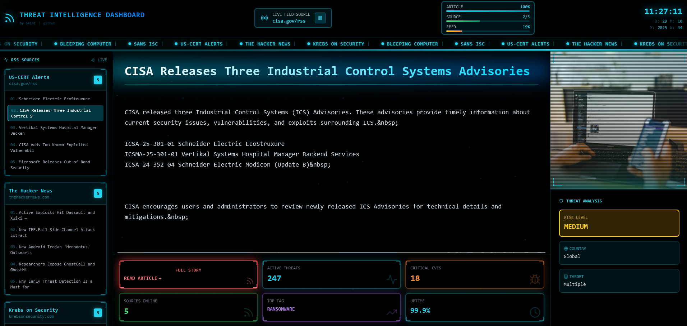

# Oblivion Threat Intelligence Dashboard

> An Oblivion movie-inspired cybersecurity threat intelligence dashboard for reading RSS feeds in a visually stunning way. Perfect for big screen displays, security operations centers, or just staying informed on the latest cybersecurity news with style.



## Overview

This is a cutting-edge, cinematic threat intelligence dashboard that transforms mundane RSS feed reading into an immersive cyberpunk experience. Inspired by the futuristic UI from the Oblivion movie, it displays real-time cybersecurity news from major sources with stunning visual effects including CRT scan lines, holographic elements, animated grids, and typewriter text rendering.

**Perfect for:**
- Big Screen Displays - Mount it on a large monitor in your security operations center or office
- Entertainment & Information - Stay informed while enjoying a visually captivating experience
- Professional Monitoring - Real-time threat intelligence aggregation from trusted sources
- Cyberpunk Aesthetics - Beautiful UI that makes security monitoring engaging

## Key Features

### Live Threat Intelligence
- **Real-time RSS Feeds** from 5 major cybersecurity sources:
  - US-CERT (CISA) Cybersecurity Advisories
  - The Hacker News
  - Krebs on Security
  - Bleeping Computer
  - SANS Internet Storm Center
- **Auto-refresh** every 5 minutes
- **Smart metadata extraction**: CVE numbers, risk levels, malware detection, attack vectors

### Oblivion-Inspired Interface
- **CRT Monitor Effects**: Horizontal scan lines on images, vertical scanning beam
- **Holographic Elements**: Glowing cyan accents, animated corner brackets
- **Animated Grid Background**: Dynamic matrix-style background
- **Typewriter Effect**: Real-time text rendering with progress tracking
- **News Ticker**: Scrolling source names in header
- **Cyberpunk Date Display**: D/M/Y/W format with futuristic styling
- **Floating Particles**: Ambient visual effects

### Dashboard Features
- Modern tile-based layout
- Auto-play with synchronized progress bars (ARTICLE, SOURCE, FEED)
- Play/pause controls
- Bottom info tiles with threat statistics
- Blinking "READ ARTICLE" button
- CRT effects on article images

### Interactive Features
- Click "READ ARTICLE" button to open full articles in new tab
- Play/pause auto-rotation
- Real-time progress tracking
- Smooth transitions and animations
- Responsive design

## Requirements

Before you begin, ensure you have the following installed:

- **Node.js** 18.x or higher ([Download](https://nodejs.org/))
- **npm** (comes with Node.js) or **yarn**
- **Git** (optional, for cloning)

### Checking Your Environment

```bash
# Check Node.js version
node --version
# Should output v18.x.x or higher

# Check npm version
npm --version
```

## Local Deployment

### Quick Start (3 Steps)

1. **Clone or download the repository**
```bash
git clone https://github.com/Stefan2483/threat-intel-dash.git
cd threat-intel-dash
```

Or download and extract the ZIP file, then navigate to the folder in your terminal.

2. **Install dependencies**
```bash
npm install
```

This will install all required packages (~100MB, takes 1-2 minutes).

3. **Run the development server**
```bash
npm run dev
```

The dashboard will be available at **http://localhost:3000**

That's it! Open your browser and navigate to the URL above.

### Production Build

For better performance and to test the production version locally:

```bash
# Build the application
npm run build

# Start the production server
npm start
```

The production build is optimized and runs faster than development mode.

### Running on a Different Port

If port 3000 is already in use:

```bash
npm run dev -- -p 3001
```

Replace `3001` with any available port number.

## Big Screen Display Setup

To run the dashboard on a dedicated display or TV:

1. **Deploy locally** on a computer connected to your display
2. **Run the production build** for best performance:
   ```bash
   npm run build && npm start
   ```
3. **Open in full-screen browser**:
   - Press `F11` in most browsers for full-screen mode
   - Or use kiosk mode:
     ```bash
     # Chrome kiosk mode (Windows)
     "C:\Program Files\Google\Chrome\Application\chrome.exe" --kiosk http://localhost:3000

     # Chrome kiosk mode (Mac)
     /Applications/Google\ Chrome.app/Contents/MacOS/Google\ Chrome --kiosk http://localhost:3000

     # Chrome kiosk mode (Linux)
     google-chrome --kiosk http://localhost:3000
     ```

4. **Optional**: Set the computer to auto-start the server on boot

## Cloud Deployment (Vercel)

Deploy your dashboard to the cloud for access from anywhere:

### Method 1: GitHub to Vercel (Recommended)

1. **Push your code to GitHub**:
   ```bash
   git init
   git add .
   git commit -m "Initial commit: Threat Intelligence Dashboard"
   git branch -M main
   git remote add origin https://github.com/Stefan2483/threat-intel-dash.git
   git push -u origin main
   ```

2. **Deploy to Vercel**:
   - Go to [vercel.com](https://vercel.com) and sign in with GitHub
   - Click "New Project"
   - Select your repository
   - Click "Deploy"
   - Vercel auto-detects Next.js and handles everything

3. **Done!** Your dashboard will be live at `your-project.vercel.app`

### Method 2: Vercel CLI

```bash
# Install Vercel CLI
npm install -g vercel

# Login
vercel login

# Deploy
vercel

# Deploy to production
vercel --prod
```

## Project Structure

```
threat-intel-dash/
├── components/
│   └── OblivionDashboardTiles.jsx      # Main dashboard component with CRT effects
├── pages/
│   ├── _app.js                         # Next.js app wrapper
│   ├── index.js                        # Landing page (auto-redirects to dashboard)
│   ├── dashboard-tiles.js              # Main dashboard page
│   └── api/
│       └── rss-feeds.js                # Server-side RSS feed fetcher
├── lib/
│   └── useRSSFeeds.js                  # React hook for RSS data management
├── styles/
│   └── globals.css                     # Global styles & scrollbar
├── public/                              # Static assets
├── package.json                         # Dependencies and scripts
├── next.config.js                       # Next.js configuration
├── tailwind.config.js                   # Tailwind CSS configuration
├── postcss.config.js                    # PostCSS configuration
├── jsconfig.json                        # Path aliases
├── .gitignore                           # Git ignore rules
├── .gitattributes                       # Git line ending configuration
├── .env.example                         # Environment variables template
├── LICENSE                              # MIT License
└── README.md                            # This file
```

## Customization

### Adding/Modifying RSS Feeds

Edit `/pages/api/rss-feeds.js`:

```javascript
const RSS_FEEDS = [
  {
    id: 1,
    name: 'Your Feed Name',
    source: 'yoursite.com',
    url: 'https://yoursite.com/rss',
    color: 'cyan'  // cyan, blue, green, purple, orange
  },
  // Add more feeds...
];
```

### Adjusting Auto-Play Speed

In `/lib/useRSSFeeds.js`, change the refresh interval:

```javascript
// Change 5 * 60 * 1000 (5 minutes) to your desired interval
const intervalId = setInterval(fetchFeeds, 5 * 60 * 1000);
```

### Changing Colors

The dashboard uses a cyan/blue color scheme. To change:

1. **Primary color** (cyan): `#00d9ff` / `rgba(0, 217, 255, ...)`
2. **Secondary color** (blue): `#0080ff` / `rgba(0, 128, 255, ...)`
3. **Update Tailwind classes**: `cyan-400`, `cyan-500`, etc.

### Adjusting CRT Effects

In `/components/OblivionDashboardTiles.jsx`:

- **Scan line speed**: Change animation duration in `scan-vertical-updown` (line ~645)
- **Glitch intensity**: Modify `glitch-image` animation transforms (line ~656)
- **Effect opacity**: Adjust opacity values in CRT effect divs (lines ~513-527)

## Troubleshooting

### Issue: Port already in use
```bash
# Kill existing processes
npx kill-port 3000

# Or use a different port
npm run dev -- -p 3001
```

### Issue: Module not found
```bash
# Clear cache and reinstall
rm -rf node_modules package-lock.json .next
npm install
```

### Issue: Build fails
```bash
# Check Node version (must be 18+)
node --version

# Clear Next.js cache
rm -rf .next
npm run build
```

### Issue: RSS feeds not loading
- Check your internet connection
- Verify RSS URLs are accessible
- Check browser console for errors
- The app uses fallback data if feeds fail

### Issue: Blank screen or errors
```bash
# Check the development server logs
# Look for error messages in the terminal

# Try a clean build
rm -rf .next
npm run dev
```

## Security Considerations

This dashboard is designed for display and monitoring purposes. For production deployment:

1. **RSS Feed Access**: Feeds are fetched server-side to avoid CORS issues
2. **Content Sanitization**: HTML tags are stripped from feed content
3. **No Authentication**: By default, no auth is implemented
4. **Rate Limiting**: Built-in rate limiting (30 requests/min)
5. **Environment Variables**: Use `.env.local` for sensitive config

**For Internal Network Use:**
- Deploy on internal servers
- Use firewall rules to restrict access
- Consider adding basic authentication

## Performance Tips

- Dashboard uses GPU-accelerated CSS animations
- Images loaded from CDN (Unsplash)
- Server-side RSS fetching prevents CORS issues
- Feed data cached for 5 minutes
- Dynamic imports reduce initial load time

## Tech Stack

- **[Next.js 14](https://nextjs.org/)** - React framework with server-side rendering
- **[React 18](https://react.dev/)** - UI library
- **[Tailwind CSS](https://tailwindcss.com/)** - Utility-first CSS framework
- **[Lucide React](https://lucide.dev/)** - Beautiful icons
- **[rss-parser](https://github.com/rbren/rss-parser)** - RSS feed parsing

## Additional Documentation

- **[Next.js Docs](https://nextjs.org/docs)** - Framework documentation
- **[Vercel Docs](https://vercel.com/docs)** - Deployment platform documentation
- **[Tailwind CSS Docs](https://tailwindcss.com/docs)** - CSS framework documentation

## Contributing

Contributions are welcome! Feel free to:
- Report bugs
- Suggest new features
- Submit pull requests
- Improve documentation

## License

MIT License - Free to use for personal or commercial purposes.

## Author

**Stefan (S4int)**
- Email: [Stefan4+ti@gmail.com](mailto:Stefan4+ti@gmail.com)
- GitHub: [@Stefan2483](https://github.com/Stefan2483)

## Acknowledgments

- **Design Inspiration**: Oblivion (2013) movie UI
- **RSS Sources**: US-CERT, The Hacker News, Krebs on Security, Bleeping Computer, SANS ISC
- **Icons**: Lucide React
- **Images**: Unsplash

## Support

If you find this project useful:
- Star the repository
- Report issues on GitHub
- Share with the cybersecurity community

---

**Made with care for the cybersecurity community**

*Stay informed. Stay secure. Stay stylish.*
